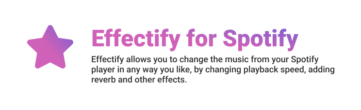

## About
Effectify is a small extension for Spotify that allows users to change playback speed and add effects to the music. Make sped up and slowed-reverb songs inside Spotify in two clicks.

Effectify is currently closed-source, because certain parts of the application are not yet in accordance with our open-source standards.

MT25 is a small development group from Moldova that is currently led by [cunev](https://github.com/cunev) and [pankerit](https://github.com/pankerit). Do not contact us directly, please open an issue here or contact us at contact@effectify.app.

## Reporting issues
Report critical Effectify issues here, in the issues section.

## Valid Reports:

- Things that affect your daily enjoyment of the extension.
- Things that don't involve implementing large new features (quick fixes only)
- Things that you wonder "why isn't this fixed" but it has never got visibility.

## Examples of valid reports:

- "Slider X stopped working after doing Y"
- "Spotify crashes when doing x"
- "Song X doesn't work"
- PC/hardware compatibility issues

## Examples of invalid reports:

- Add another slider for pitch shifting
- I don't like the speed up sound
- Windows Store Spotify is not working

**We want to help everyone** but some issues might take more than others, and we have a priority queue based on the scope of the issue.